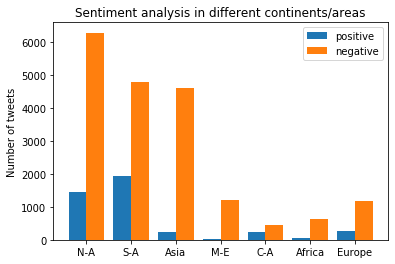
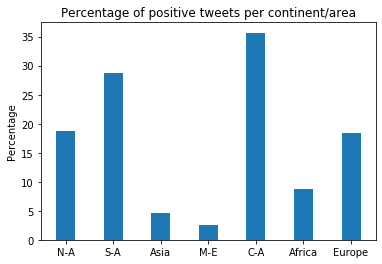

# Proyecto Integrador #1
##### Esta actividad contiene un analizador de sentimientos utilizando el api de [twitter](https://developer.twitter.com), en base a un término de busqueda ingresado por el usuario. Reconoce los tweets positivos o negativos; además de clasificarlos por ubicación geográfica.

Utilizando la librera nltk en conjunto con tweep, el programa recibe un stream utilizando el api de twitter, realizando las busqueda de tweets emitidos en un rango de coordenadas, y tokenizando el stream de salida. Despues de ello, el analizador de sentimientos clasifica el numero de comentarios positivos y negativos de cada continente. (El stream de twits varia de información por ser busqueda en tiempo real, y la cantidad varía por ubicación, se tiene un limite duro de 6,000 tweets).

El código en el jupyter notebook, muestra los URLs minados, así como aquellos que son descargados. 

Consideramos en base al programa y su presentación que presentaría un buen punto de partida para aquellos interesados en desarrollar un analizador de sentimientos de twits, u bases de datos de terceras personas.

##### Representación y fuente de datos. 
Los twits utilizados son extraidos de un query desde el api de twitter con la libreria [tweepy](https://www.tweepy.org/),  y analizados por la herramienta [nltk](https://www.nltk.org/).

##### Dependencias 
1. nltk
2. tweepy

##### Algoritmo
1. Busqueda de streams de twitts por ubcación geogŕafica.

```
# Search of African twiits
twitterStream = Stream(auth, listener())
twitterStream.filter(locations=[-15.258424824,-33.8737847792,37.7103108709,36.3118596404])
```
2. Evaliuar el sentimiento.

```
def sentiment(text):
    feats = find_features(text)
    return voted_classifier.classify(feats), voted_classifier.confidence(feats)
```

3. Almacenar el resultado (sentimiento) en archivo.

```
 sentiment_value, confidence = s.sentiment(tweet)
        print(tweet, sentiment_value, confidence)
        
        if confidence*100 >= 80:
            output = open("data/twitter-africa.txt","a")
            output.write(sentiment_value)
```

4. Grafica los resultados del los archivos.

```
def animate(i):
    pullData = open("twitter-out.txt","r").read()
    lines = pullData.split('\n')
    
    xar = []
    yar = []
    
    x = 0
    y = 0
    
    for l in lines[-200:]:
        x += 1
        if "pos" in l:
            y += 1
        elif "neg" in l:
            y -= 1 #modifiable based on the bias. 
            
        xar.append(x)
        yar.append(y)
    
    ax1.clear()
    ax1.plot(xar,yar)
```

##### Las imagenes son graficas de humor de twitter por ubicación geográfica.

 
 
 Los tweets de distintos continentes/zonas del mundo fueron recolectados el domingo 25 de Octubre entre las 7 p.m. y las 8:30 p.m. hora del centro de México.
 Las zonas analizadas fueron las siguientes
 * América del Norte (N-A)
 * América del Sur (S-A)
 * Asia
 * Medio Oriente (M-E)
 * América central (C-A)
 * África
 * Europa

Los tweets fueron calificados como positivos o negativos basados en su contenido. La gráfica de la izquierda muestra el número total de tweets negativos y positivos por continente/zona durante el periodo mencionado, mientras que la gráfica de la derecha muestra el porcentaje de tweets positivos por cada continente/zona.

 
##### Contribuidores
* [GustavoDLRA](https://github.com/GustavoDLRA)
* [hugoyervides](https://github.com/hugoyervides)
* Astrid
* [olefran](https://github.com/olefran)
* [Felipe Villaseñor](https://github.com/Felipev201)

En caso de estar interesado en una introducción al procesamiento de lenguaje, o analizador de sentimientos:
- [NLTK Tutorial by sentdex](https://www.youtube.com/playlist?list=PLQVvvaa0QuDf2JswnfiGkliBInZnIC4HL)
- [Natural Language Processing Standford University Course](https://www.youtube.com/watch?v=mOAXEQevCAE&ab_channel=AutomationStepbyStep-RaghavPal)

Para aprovechar al máximo este repositorio y poder editarlo al momento de descargarlo se recomienda el uso de Jupyter Notebook mediante Anaconda: 
1. Instalar [Anaconda](https://www.anaconda.com/products/individual)
2. Instalar [nltk](https://www.nltk.org/).
3. Instalar [tweepy](https://www.tweepy.org/)
4. Remplazar la key, comsumer secret, access token y access secret en los archivos bot_\*.py (obtenido de una cuenta developer de twitter)
```
#consumer key, consumer secret, access token, access secret.
ckey=""
csecret=""
atoken=""
asecret=""
```
5. Abrir Jupyter Notebook
